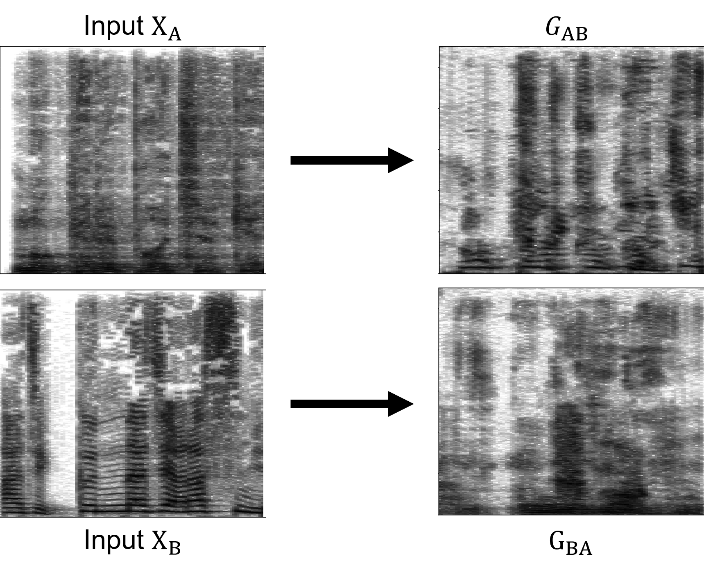

# Technique that Effectively Preserves Audio Identity in Bidirectional Style Conversion Using GAN
This is the code implementation for project submitted as the partial requirement for the 'Machine Learning Application' course in Korea University.

## Instruction
### 1. Make Folders
```bash
python mkdir.py
```
### (Option) 2. Combine short length audio into one file
```bash
python compile.py --istrain --istest
```

### 3. Preprocess for train and evaluate
```bash
python gen_npy.py --iscut
python gen_npy.py --isnpy
```

### 4. Train model
```bash
python model.py
```

### 5. Evaluate test data
```bash
python target_inference.py
```

### 6. Make all result files one
```bash
python compile.py --mkresult
```

### 7. Get spectrograms
```bash
python gen_spectrograms.py
```

### 8. Euclidean Distance Test
```bash
python distance.py
```

## Notes
### Spectrograms
Figure 4. in Paper


### Euclidean distance test
Table 1. in Paper

|DATASET         |MEAN  |STD  |
|:---------------|:-----|:----|
|Train A & Test A|533.48|12.11|
|Train A & G_BA  |510.24|11.22|
|Train A & Test A|558.32| 8.67|
|Train A & G_AB  |500.7 | 8.39|
